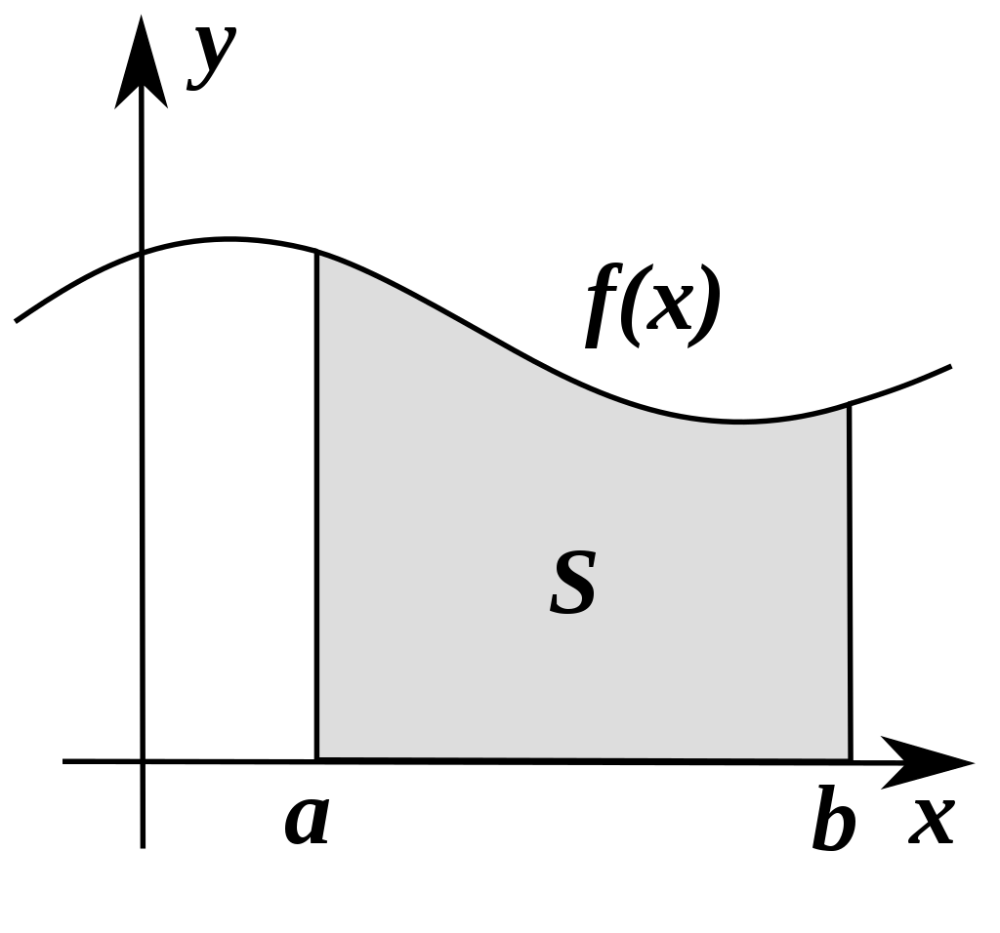

**Плотность вероятности** — один из способов задания [[Распределение|распределения случайной величины]]

#Определение 
Плотность распределения вероятностей случайной величины - это функция $f_X(x)$ такая, что $$P(a \leq x \leq b) = S = \int\limits_a^bf_X(x)dx$$

#Свойства 
1) Плотность распределения неотрицательна при любом $x$ и нормирована, то есть

$$\int_{-\infty}^{+\infty}f_X(x)\,\mbox{d}x = 1$$

2) При стремлении $x$ к $\,\pm\infty$ функция $f(x)$ стремится к нулю. 
$$\lim\limits_{x\rightarrow\pm\infty}f_X(x) = 0$$
4) Размерность плотности распределения всегда обратная к размерности случайной величины — если $\xi$ исчисляется в метрах, то размерностью $f$ будет м-1
5) $$\int_{-\infty}^{x_0}f_X(x)\,\mbox{d}x = F(x_0)$$ Функция $F(x)$ - [[Функция распределения вероятности|функция распределения вероятности]] 